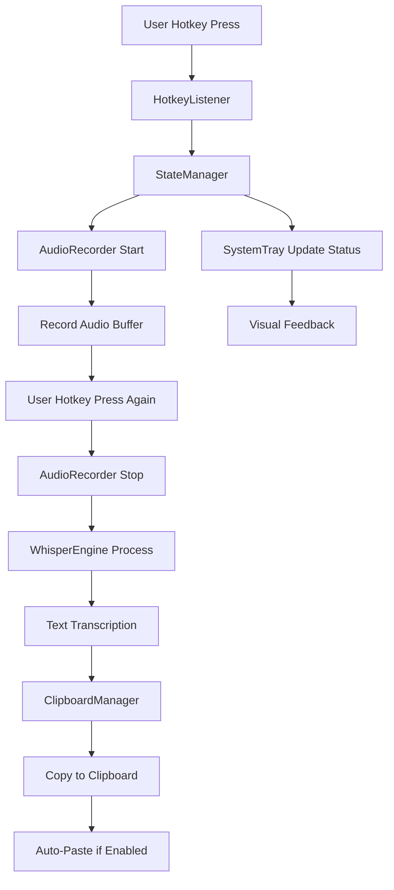

# Whisper Speech-to-Text App - Project Index

## 📋 Project Overview

**Purpose**: Local faster-whisper speech-to-text application with global hotkey functionality  
**Target Platform**: Windows 10+ (Python execution)  
**Development Environment**: WSL for development, Windows for runtime  
**Learning Context**: Beginner-friendly codebase with detailed explanations

## 🏗️ Architecture Overview

### Core Technology Stack
- **AI Engine**: faster-whisper (local OpenAI Whisper implementation)
- **Audio Capture**: sounddevice (cross-platform audio I/O)
- **Global Hotkeys**: global-hotkeys (system-wide key detection)
- **Clipboard**: pyperclip + pywin32 (clipboard operations & auto-paste)
- **System Integration**: pystray (system tray), pyautogui (key simulation)
- **Configuration**: ruamel.yaml (YAML config management)

### Application Flow
```
User Hotkey Press → Audio Recording → Whisper Transcription → Clipboard Copy → Auto-Paste
                                          ↓
                    System Tray Status Updates & User Notifications
```

## 📁 Project Structure

```
whisper-key-local/
├── whisper-key.py              # 🎯 Main application entry point
├── config.yaml                 # ⚙️ User configuration settings
├── requirements.txt             # 📦 Python dependencies
├── CLAUDE.md                   # 🤖 Claude AI project instructions
├── README.md                   # 📚 Project documentation
├── app.log                     # 📝 Application log file
│
├── src/                        # 🔧 Core application modules
│   ├── __init__.py             
│   ├── audio_recorder.py       # 🎤 sounddevice audio capture
│   ├── clipboard_manager.py    # 📋 clipboard & auto-paste operations
│   ├── config_manager.py       # ⚙️ YAML configuration management
│   ├── hotkey_listener.py      # ⌨️ global hotkey detection
│   ├── state_manager.py        # 🎯 component coordination & workflow
│   ├── system_tray.py          # 🖥️ system tray icon & menu
│   └── whisper_engine.py       # 🧠 faster-whisper transcription
│
├── tests/                      # 🧪 Test suite
│   ├── component/              # Unit tests for individual components
│   │   ├── test_audio.py       # Audio recording tests
│   │   ├── test_clipboard.py   # Clipboard operations tests
│   │   ├── test_hotkeys.py     # Hotkey listener tests
│   │   └── test_whisper.py     # Whisper engine tests
│   └── run_component_tests.py  # Test runner script
│
├── tools/                      # 🛠️ Utility scripts
│   ├── key_helper.py           # Interactive hotkey configuration
│   ├── clear_log.py            # Log file cleanup
│   ├── clear_model_cache.py    # Whisper model cache cleanup
│   ├── create_tray_icons.py    # System tray icon generation
│   └── reset_user_settings.py  # Configuration reset utility
│
├── assets/                     # 🎨 Visual resources
│   ├── tray_idle.png           # System tray - idle state
│   ├── tray_recording.png      # System tray - recording state
│   └── tray_processing.png     # System tray - processing state
│
└── documentation/              # 📖 Project documentation
    ├── roadmap.md              # Feature roadmap & user stories
    ├── project-index.md        # This comprehensive index (YOU ARE HERE)
    └── implementation-plans/   # Technical implementation planning
        ├── README.md           
        └── state-management-update-2025-01-28.md
```

## 🔧 Component Architecture

### Core Components & Responsibilities

| Component | File | Primary Responsibility | Key Technologies |
|-----------|------|----------------------|------------------|
| **Entry Point** | `whisper-key.py` | Application orchestration & startup | logging, threading |
| **Audio Capture** | `audio_recorder.py` | Microphone recording & audio buffering | sounddevice, numpy |
| **Speech Recognition** | `whisper_engine.py` | Audio transcription using AI | faster-whisper |
| **Clipboard Operations** | `clipboard_manager.py` | Text copying & auto-paste functionality | pyperclip, pywin32, pyautogui |
| **Hotkey Detection** | `hotkey_listener.py` | Global hotkey monitoring | global-hotkeys |
| **Configuration** | `config_manager.py` | YAML settings management & validation | ruamel.yaml |
| **System Integration** | `system_tray.py` | System tray icon & menu interface | pystray, Pillow |
| **State Coordination** | `state_manager.py` | Component orchestration & workflow | threading, logging |

### Data Flow Architecture



## ⚙️ Configuration System

### Configuration Categories

| Category | Purpose | Key Settings |
|----------|---------|--------------|
| **whisper** | AI model configuration | model_size (tiny/base/small), device (cpu/cuda), language |
| **hotkey** | Hotkey combinations | combination (ctrl+` default) |
| **audio** | Recording settings | sample_rate (16000), channels (1), max_duration (30s) |
| **clipboard** | Paste behavior | auto_paste (true), paste_method (key_simulation), preserve_clipboard |
| **logging** | Debug & monitoring | level (INFO), file/console output settings |
| **performance** | Resource optimization | cpu_threads, memory management |
| **system_tray** | UI integration | enabled, tooltip, notifications |
| **advanced** | Experimental features | VAD, debug options, model caching |

### Default Model Configuration
- **Model**: tiny (39MB) - fastest, good accuracy for most use cases
- **Device**: CPU (universal compatibility)
- **Compute Type**: int8 (optimal speed/quality balance)
- **Language**: auto-detect

## 🧪 Testing Framework

### Component Test Coverage
- **Audio Recording**: Microphone access, buffer management, recording states
- **Clipboard Operations**: Copy functionality, auto-paste methods, fallback mechanisms
- **Hotkey Detection**: Key combination recognition, conflict handling
- **Whisper Engine**: Model loading, transcription accuracy, error handling

### Test Execution
```bash
python tests/run_component_tests.py  # Run full test suite
```

**Note**: Tests designed for Windows environment; WSL development requires Windows testing

## 🛠️ Development Tools

### Utility Scripts

| Tool | Purpose | Usage |
|------|---------|-------|
| `key_helper.py` | Hotkey configuration assistant | Interactive key combination testing |
| `clear_log.py` | Log file management | Remove application log files |
| `clear_model_cache.py` | Model cache cleanup | Clear faster-whisper model cache |
| `create_tray_icons.py` | Icon generation | Create system tray icons |
| `reset_user_settings.py` | Configuration reset | Restore default settings |

### Development Workflow
1. **Code in WSL**: Use Linux development environment
2. **Test on Windows**: Execute application in Windows Python
3. **No Auto-Testing**: Manual testing required due to platform constraints
4. **Configuration**: Use `tools/key_helper.py` for hotkey setup

## 🔧 Development Commands

```bash
# Application Execution
python whisper-key.py                    # Run the application

# Testing & Validation  
python tests/run_component_tests.py      # Execute test suite

# Configuration & Utilities
python tools/key_helper.py               # Configure hotkey combinations
python tools/clear_log.py                # Clean up log files
python tools/clear_model_cache.py        # Clear model cache
python tools/reset_user_settings.py      # Reset configuration

# Icon Management
python tools/create_tray_icons.py        # Generate system tray icons
```

## 📋 Development Guidelines

### Code Standards
- **Documentation**: Extensive comments for beginner learning
- **Error Handling**: Graceful fallbacks and user notifications
- **Modularity**: Clear separation of concerns across components
- **Testing**: Component-level test coverage
- **Configuration**: YAML-based settings with validation

### Platform Considerations
- **Development**: WSL/Linux environment for coding
- **Runtime**: Windows Python environment for execution  
- **Testing**: Manual testing required due to platform constraints
- **Dependencies**: Windows-specific libraries (pywin32, global-hotkeys)

---

## 📚 Related Documentation

- **[Feature Roadmap](roadmap.md)** - User stories & planned features  
- **[Implementation Plans](implementation-plans/)** - Technical planning documents
- **[Configuration Reference](../config.yaml)** - Complete settings documentation
- **[Main Application](../whisper-key.py)** - Entry point with startup orchestration

---

*Last Updated: 2025-01-29 | Project Status: Active Development*